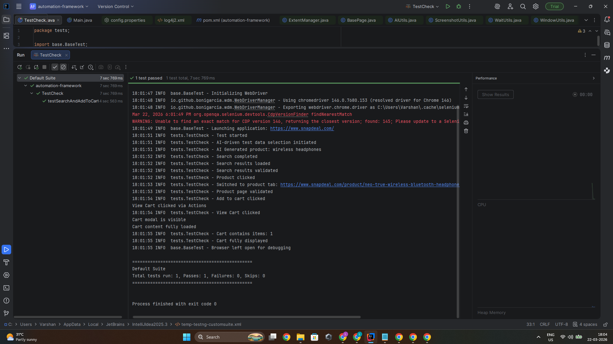

# 🛒 Snapdeal Automation Framework

## 📌 Overview

This project is a **Selenium-based automation framework** built using **Java + TestNG** to automate core user flows of the Snapdeal web application.

The framework follows **Page Object Model (POM)** design principles and includes advanced features like **logging, reporting, dynamic test data, and failure handling**.

---

## 🎯 Objective

* Automate core user scenarios on Snapdeal
* Build a **scalable and maintainable automation framework**
* Implement best practices like **explicit waits, POM, and modular design**

---

## ⚙️ Tech Stack

* **Language:** Java
* **Automation Tool:** Selenium WebDriver
* **Test Framework:** TestNG
* **Build Tool:** Maven
* **Logging:** Log4j
* **Reporting:** Extent Reports
* **Driver Management:** WebDriverManager

---

## 🧱 Framework Architecture

```
automation-framework/
│
├── base/              # Base classes (Driver setup, Test setup)
├── pages/             # Page Object Model classes
├── tests/             # Test classes
├── utils/             # Utility classes (Waits, AI, Screenshot, Reports)
├── listeners/         # TestNG listeners (Screenshot + Report)
├── resources/         # Config files
├── reports/           # Extent HTML reports
├── screenshots/       # Failure screenshots
└── pom.xml            # Maven dependencies
```

---

## 🔑 Key Features

### ✅ Page Object Model (POM)

* Each page has a separate class
* All locators are encapsulated inside page classes
* Improves maintainability and reusability

---

### ✅ Configuration Management

* Uses `config.properties`
* Stores:

  * Base URL
  * Browser
  * Timeout
  * Auto close flag

---

### ✅ Explicit Wait Handling

* Centralized `WaitUtils`
* No use of `Thread.sleep`
* Config-driven timeout

---

### ✅ Logging

* Log4j integrated
* Provides clear execution trace

---

### ✅ Screenshot on Failure

* Implemented using TestNG Listener
* Automatically captures screenshot on test failure

---

### ✅ Extent HTML Reporting

* Generates detailed HTML report after execution
* Includes:

  * Test status (Pass/Fail)
  * Error details
  * Screenshots

---

### 🌟 AI-Based Test Data (Bonus Feature)

* Uses `AIUtils` to generate dynamic product inputs
* Avoids hardcoded test data
* Simulates AI-assisted testing workflow

---

## 🧪 Automated Test Scenario

### Test: Search and Add to Cart

Steps automated:

1. Search for a product (AI-generated)
2. Validate search results
3. Click on first product
4. Switch to new tab
5. Validate product page
6. Add product to cart
7. Click **View Cart**
8. Validate cart modal
9. Verify item count in cart

---

## ▶️ How to Run the Project

### Prerequisites

* Java 17+
* Maven installed
* Chrome browser

---

### Steps

```bash
git clone <your-repo-link>
cd automation-framework
mvn clean test
```

OR run via IntelliJ:

* Right click → `TestCheck.java`
* Click **Run**

---

## 📸 Execution Result



```
19:49:38 INFO  base.BaseTest - Launching application: https://www.snapdeal.com/
19:49:39 INFO  tests.TestCheck - Test started
19:49:39 INFO  tests.TestCheck - AI-driven test data selection initiated
19:49:39 INFO  tests.TestCheck - AI Generated product: smart watch
19:49:40 INFO  tests.TestCheck - Search completed
19:49:40 INFO  tests.TestCheck - Search results loaded
19:49:40 INFO  tests.TestCheck - Search results validated
19:49:40 INFO  tests.TestCheck - Product clicked
19:49:42 INFO  tests.TestCheck - Switched to product tab: https://www.snapdeal.com/product/life-like-ultra-max-smart/635219384597#bcrumbSearch:smart%20watch
19:49:42 INFO  tests.TestCheck - Product page validated
19:49:43 INFO  tests.TestCheck - Add to cart clicked
View Cart clicked via Actions
19:49:43 INFO  tests.TestCheck - View Cart clicked
Cart modal is visible
Cart content fully loaded
19:49:44 INFO  tests.TestCheck - Cart contains items: 1
19:49:44 INFO  tests.TestCheck - Cart fully displayed
19:49:44 INFO  base.BaseTest - Browser left open for debugging

===============================================
Default Suite
Total tests run: 1, Passes: 1, Failures: 0, Skips: 0
===============================================


Process finished with exit code 0
```

---

## 📊 Report

After execution, open:

```
/reports/ExtentReport_<timestamp>.html

Note: The latest report generated will follow this format:
ExtentReport_YYYYMMDD_HHMMSS
Example: ExtentReport_20260322_194936
```

---

## 🧠 Key Learnings

* Handling dynamic web elements and overlays
* Implementing synchronization using explicit waits
* Designing scalable automation frameworks
* Integrating reporting and logging systems

---

## 📊 Results

[Lokeshwar_Assignement_Report.pdf](results/Lokeshwar_Assignement_Report.pdf)

---

## 🚀 Future Enhancements

* Parallel test execution
* Cross-browser support
* CI/CD integration
* Advanced reporting (Allure)

---

## 👨‍💻 Author

**Lokeshwar S R**

---